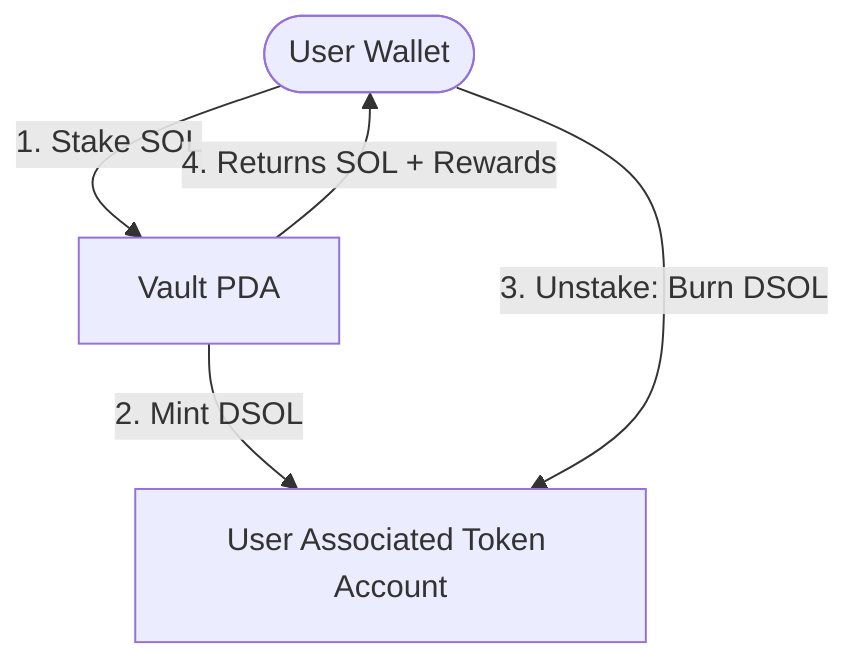

# LSP 2.0 — Solana Liquid Staking Protocol

LSP 2.0 is an optimized, production-ready Liquid Staking Derivative (LSD) built using the Solana Anchor framework. It converts staked SOL deposits into a custom liquid representation token (**DSOL**). 

Staked SOL is centrally pooled inside a Vault PDA, while `DSOL` tokens are minted 1:1 to the user's Associated Token Account (ATA). Rewards accrue lazily in real-time. Upon unstaking, `DSOL` is burned and the user is paid back their SOL principal plus accrued rewards.

---

## 🏗️ Architecture & Core Features

### 1. Centralized Vault & Mint Authority PDA
All deposited SOL is collected centrally inside a secure `[b"vault"]` Vault PDA instead of individual user-specific staking accounts, optimizing pool liquidity and simplifying reward accounting. The Vault PDA also acts as the exclusive mint authority of the DSOL Mint.

### 2. Metaplex Metadata CPI Integration
Integrates with the **Metaplex Token Metadata Program** (`metaqbxxUerdq28cj1RbAWkYQm3ybzjb6a8bt518x1s`). When the protocol mint is initialized, a Cross-Program Invocation (CPI) registers the token name (`DSOL Liquid Staked SOL`) and symbol (`DSOL`) on-chain.

### 3. $O(1)$ Lazy Reward Accrual Engine
Rather than running expensive transaction loops or cron jobs, rewards accrue lazily. Yield updates are computed on-demand when users stake or unstake based on elapsed time:
$$\text{reward} = \frac{\text{amount} \times \text{elapsed days}}{2}$$

### 4. Direct Lamport Payouts (Gas Optimized)
To minimize transaction fees, the unstaking instruction transfers SOL out of the Vault PDA to the user by modifying lamports balance directly (`try_borrow_mut_lamports`), bypassing the compute overhead of standard System Program CPI transfers.

### 5. Premium Dashboard UI
A glassmorphic dark-themed single-page client built with Solana Web3.js and Tailwind CSS v4 featuring:
* **Auto-Connect**: Automatically reconnects trusted browser wallet extensions (Phantom/Solflare) silently on refresh.
* **Live Accrued Reward Ticker**: Simulates the on-chain lazy reward calculation every second, showing the user's yield ticking up in real-time.
* **Protocol Setup Detection**: Detects and enforces on-chain initialization status of the Vault and Mint PDAs before allowing user interactions.

---

## 🗺️ Protocol Flow



---

## 🛠️ Instructions & Commands

### Prerequisites
* Rust & Cargo installed
* Solana CLI tools installed
* Anchor CLI installed

### Compile the Smart Contract
```bash
anchor build
```

### Run the Mocha Test Suite
The local test suite boots up a temporary validator, clones the Metaplex program from Devnet, and runs the validation test cases:
```bash
anchor test
```

### Deploy to Devnet
Set `cluster = "devnet"` in `Anchor.toml`, then run:
```bash
solana program deploy target/deploy/staking_cpi.so --url devnet
```

### Serve the Frontend UI Locally
```bash
npx serve app/
```
Once served, open `http://localhost:3000` (or the served port) in your browser. Connect Phantom/Solflare on Devnet, initialize the Vault and Mint if doing it on a fresh program ID, and begin staking!

---

## 📁 Codebase Layout

```text
├── app/                  # Frontend UI (index.html, CSS, JS integrations)
├── programs/staking-cpi/ # Anchor Smart Contract code
│   └── src/
│       ├── instructions/ # Handler files (init_mint, init_vault, stake, unstake)
│       ├── lib.rs        # Program entrypoint and routing
│       └── state.rs      # Account structs (StakingAccount, VaultAccount)
├── tests/                # Mocha TS integration tests
└── Anchor.toml           # Anchor configuration and validator cloning setup
```
